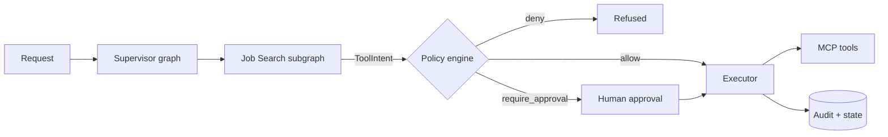

# PersonalOS

Local-first, multi-agent personal assistant that automates job search, orchestrated with LangGraph. An LLM proposes actions; a deterministic policy engine authorizes them and an isolated executor runs them, with durable state, human-approval gates, and a full audit trail.

## How it works

The model emits intent only. It never calls a tool or touches a credential.



1. **Route.** A Supervisor graph classifies the request into a typed routing decision, plans a bounded set of tasks, and hands off to a domain subgraph.
2. **Propose.** The subgraph expresses every tool call as a `ToolIntent`.
3. **Decide.** The policy engine returns `allow`, `require_approval`, or `deny`, and records the verdict before anything runs.
4. **Approve.** Anything that writes outside the system pauses the workflow until a human approves it.
5. **Execute.** The executor runs only approved intents, exactly once per idempotency key, and writes the result and its audit record together.

Workflow state is checkpointed to PostgreSQL at each step, so a run survives a crash or a deploy and resumes where it stopped.

For the full architecture diagram and the allowed dependency direction between layers, see [Dependency direction](docs/ARCHITECTURE_BOUNDARIES.md#dependency-direction) in `docs/ARCHITECTURE_BOUNDARIES.md`.

## Overview

### Orchestration

- Supervisor graph with typed routing, backed by a structured-output LLM classifier or a deterministic keyword classifier
- Job Search subgraph: search, normalize, deduplicate, filter, score, evidence check, rank, shortlist, approval, execute, persist
- Durable checkpoints with resume by workflow ID, and leases so two workers cannot resume the same workflow
- Long waits with a trigger and an expiry, such as "follow up after 7 days if there is no reply"

### Security

- Default-deny policy engine; tools are classed by how recoverable their side effect is, from `read_local` to `destructive`
- A single tool gateway: no code path reaches a tool without a policy decision
- Credentials stay in the OS keychain. The rest of the system holds only a reference (`cred://...`), and short-lived tokens are issued at execution time
- Credentials are redacted from logs, traces, checkpoints, and audit payloads
- File tools are sandboxed to configured roots, with protection against `..` and symlink traversal
- Every mutating action is idempotent and recorded with the policy decision and approval that authorized it

### Persistence

- PostgreSQL with Alembic migrations (`migrations/versions`)
- Tables for workflows and checkpoints, job postings and applications, approvals, policy decisions, tool executions, and audit events
- An immutable event log with a status projection, and an outbox table for async processing
- pgvector tables for semantic retrieval over resume evidence, job descriptions, and messages

### API and tools

- FastAPI service with job-search endpoints under `/api/v1/jobs` (create, get, list)
- MCP servers: jobs (`search_jobs`, `scrape_job_details`, `filter_jobs`, `save_favorite_job`) and files (`read_file`, `write_file`)

### Code layout

| Package | Owns |
| --- | --- |
| `personalos/graphs` | Supervisor and domain subgraphs |
| `personalos/policy` | Authorization decisions; never executes |
| `personalos/executor` | Action execution, retries, credential brokering |
| `personalos/persistence` | Relational state, checkpoints, outbox, audit |
| `personalos/tools`, `personalos/mcp`, `mcp_servers/*` | Tool gateway and MCP servers |
| `apps/api`, `apps/worker` | FastAPI service and background runners |

Layer boundaries are enforced in CI by `scripts/check_boundaries.py`. See `docs/ARCHITECTURE_BOUNDARIES.md`.

## Quick start

Requires Python 3.10+ and PostgreSQL with the `vector` extension (the `pgvector/pgvector:pg16` image works).

```bash
pip install -e ".[dev,test]"
cp .env.example .env   # set DATABASE_URL and FILES_ALLOWED_ROOTS
python -m personalos.cli db_init
python -m personalos.cli api --reload
```

`FILES_ALLOWED_ROOTS` is a JSON list of absolute paths; left empty, every file read and write is rejected. Secrets (refresh tokens, API keys, the OAuth client secret) go in the OS keychain, never in `.env`.

Run the checks CI runs:

```bash
python scripts/check_boundaries.py
pytest tests
ruff check personalos apps mcp_servers tests scripts
```

See `IMPLEMENTATION_GUIDE.md` for data flow and API details.

## Status

Actively in development. The foundation is in place: contracts and boundaries, the data model, the orchestration runtime, and the security boundary, covered by 600+ tests.

Still to come:

- Deeper job-search workflow: application lifecycle state machine, tailored artifacts, recruiter-event classification
- File, Communications, and Calendar subgraphs (the route domains are reserved) and the Google MCP server
- API endpoints for workflows, approvals, the application board, and the audit trail, with streaming progress
- Outbox publisher and a long-running worker process
- End-to-end tracing, an evaluation harness, and adversarial tests
